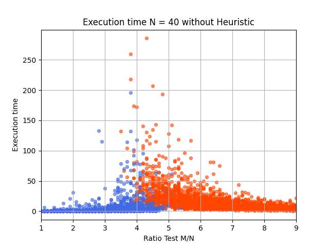
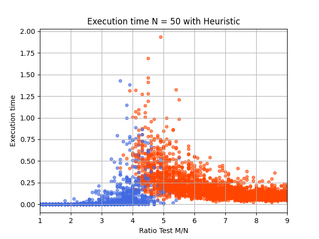
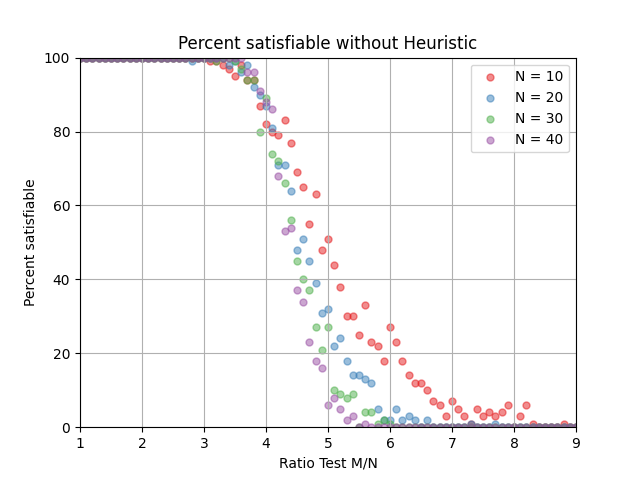
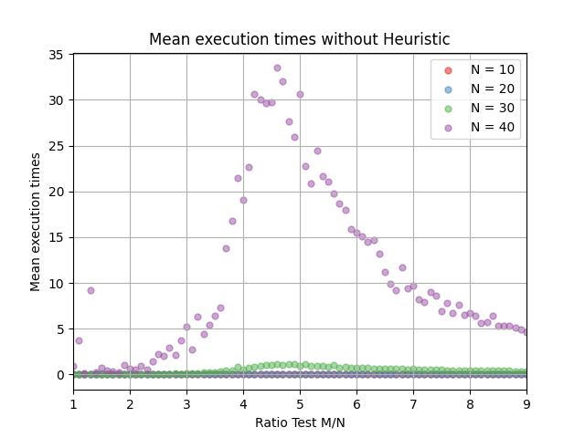
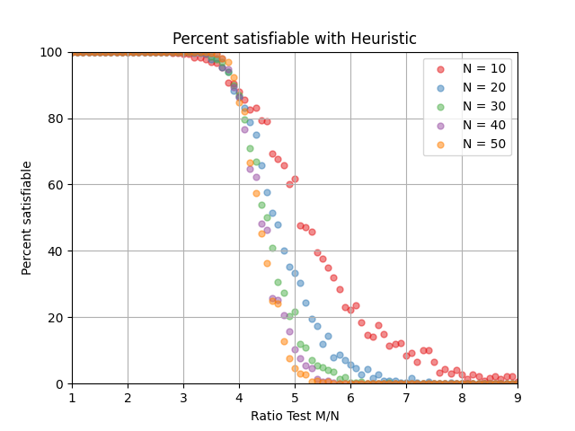
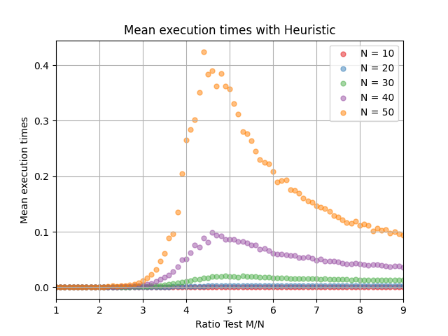

# Statistical Physics - SAT-Solver
University Exam of Statistical Physics UNIFI, Implementation of a SAT Solver to demonstrate a critical region.

A project report in Italian is available here: https://www.overleaf.com/read/qcpqptpgcrqr#e26ea0

# First experiment: Satisfiability

<table>
 <tr>
    <td></td>
    <td></td>
 </tr>
</table>

#  Second and Third experiment: Percentege of satisfiability and Execution time

In the first case, we present the results of a SAT solver without heuristics.

<table>
 <tr>
    <td></td>
    <td></td>
 </tr>
</table>

In the second case, we present the results of a SAT solver with heuristics.

<table>
 <tr>
    <td></td>
    <td></td>
 </tr>
</table>
